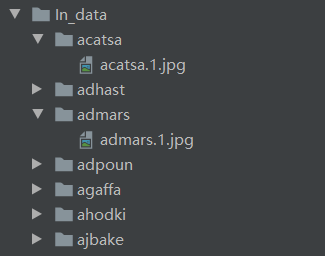

+ 一次性导入数据库：使用 face_in.py，请将数据库中每个人组织成单个文件夹的形式，如图

  
  + 格式为 python face_in.py -i <image_path> -d <dataset_path, default:'dataset'>
  + 样例输入：python face_in.py -i In_data -d dataset.json
  + 样例输出：在当前工作目录下生成（default）名为"dataset.json"的文件，即为数据库
  + 若为直接调用函数的话，传入包含上面两种信息的字典即可，输出不变
    + 即类似 {'image_path':<>, 'dataset_path':<>} 的参数

+ 添加单个人像：使用 face_append.py，格式为 python face_append.py -i <image_path> -n <human_name> -d <dataset_name>
  + 样例输入：python face_append.py -i In_data/acatsa/acatsa.1.jpg -n acatsa -d dataset.json
  + 样例输出：修改指定的 dataset.json，向其中添加新的人脸数据
  + 若为直接调用函数的话，传入包含上面三种信息的字典即可，输出不变
    + 即类似 {'image_path':<>, 'dataset_path':<>, 'name':<>} 的参数

+ 从数据库中判别人脸：使用 classify_func.py，格式为 python classify_func.py -i <image_path> -d <dataset_path>
  + 样例输入: python classify_func.py -i In_data/acatsa/acatsa.1.jpg -d dataset.json
  + 样例输出：'acatsa'
  + 若为直接调用函数的话，传入包含上面三种信息的字典即可，输出不变
    + 即类似 {'image_path':<>, 'dataset_path':<>} 的参数

+ 剪切人脸 和 输出特征向量的 **接口**，见 interface.py 中的 mtcnn_single() 和 embedding_single() 函数
  + mtcnn_single() 
    + 输入：字典，{'image_path':<>, 'save_path':< default:None >}
    + 输出：返回剪切后的图片，同时在 save_path 保存剪切后的图片
  + embedding_single()
    + 输入：字典， {'image_path':<>}
    + 输出：返回编码向量

+ 一键将图片库中人脸进行 mtcnn 剪裁，见 mtcnn_trans() 函数
  + 输入：字典，{'image_path':<>}
  + 输出：无返回值，剪裁后替换原有图片位置
  + **注意**：需要图片库的组织形式如本文开头 face_in.py 的要求那样

