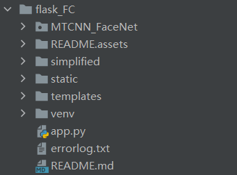
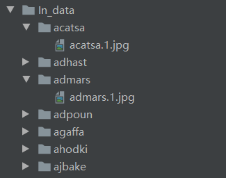
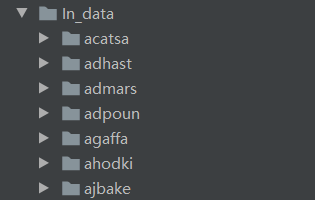
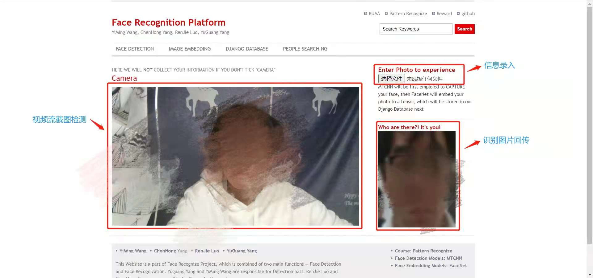

## 模式识别大作业——人脸检测与识别平台

本项目是一个简易的人脸检测识别平台，提供了**人脸信息录入**和**人脸识别**的功能。前端采用 html+css+js，后端采用 pytorch，前后端交互采用 flask。

### 0 环境依赖

    flask==2.0.1
    werkzeug==2.0.1
    torch==1.10.1
    torchvision==0.11.1
    pillow==8.2.0

### 1 文件结构


```MTCNN_FaceNet```：人脸检测算法接口

```simplified```：人脸识别算法接口

```static```：静态资源文件夹（包含数据库）

```templates```：前端Html框架

```app.py```：前后端交互flask框架

### 2 人脸识别算法——facenet

+ 一次性导入数据库：使用 ```face_in.py```，请将数据库中每个人组织成单个文件夹的形式，如图

  

  + 格式为 python face_in.py -i <image_path> -d <dataset_path, default:'dataset'>
  + 样例输入：python face_in.py -i In_data -d dataset.json
  + 样例输出：在当前工作目录下生成（default）名为"dataset.json"的文件，即为数据库
  + 若为直接调用函数的话，传入包含上面两种信息的字典即可，输出不变
    + 即类似 {'image_path':<>, 'dataset_path':<>} 的参数


+ 添加单个人像：使用 ```face_append.py```，格式为 python face_append.py -i <image_path> -n <human_name> -d <dataset_name>
  + 样例输入：python face_append.py -i In_data/acatsa/acatsa.1.jpg -n acatsa -d dataset.json
  + 样例输出：修改指定的 dataset.json，向其中添加新的人脸数据
  + 若为直接调用函数的话，传入包含上面三种信息的字典即可，输出不变
    + 即类似 {'image_path':<>, 'dataset_path':<>, 'name':<>} 的参数


+ 从数据库中判别人脸：使用 ```classify_func.py```，格式为 python classify_func.py -i <image_path> -d <dataset_path>
  + 样例输入: python classify_func.py -i In_data/acatsa/acatsa.1.jpg -d dataset.json
  + 样例输出：'acatsa'
  + 若为直接调用函数的话，传入包含上面三种信息的字典即可，输出不变
    + 即类似 {'image_path':<>, 'dataset_path':<>} 的参数


+ 剪切人脸 和 输出特征向量的 **接口**，见 ```interface.py``` 中的 mtcnn_single() 和 embedding_single() 函数
  + mtcnn_single() 
    + 输入：字典，{'image_path':<>, 'save_path':< default:None >}
    + 输出：返回剪切后的图片，同时在 save_path 保存剪切后的图片
  + embedding_single()
    + 输入：字典， {'image_path':<>}
    + 输出：返回编码向量


+ 一键将图片库中人脸进行 mtcnn 剪裁，见 mtcnn_trans() 函数
  + 输入：字典，{'image_path':<>}
  
  + 输出：无返回值，剪裁后替换原有图片位置

  + **注意**：需要图片库的组织形式如本文开头 face_in.py 的要求那样见 mtcnn_trans() 函数
  
    
  
+ classify_test() 函数

  + 输入：字典，{'img_path':<>, 'dataset_path':<>, 'origin_data':<>}
    + img_path，输入图片的路径位置
    + dataset_path，之前保存的数据 json
    + origin_data，图片的保存位置，即各个人脸的总保存位置
    + 
    + 就像上面这样的话，origin_data = 'In_data'
  + 输出：
    + 若找到匹配的人脸。返回路径，示例：'In_data/acatsa/acatsa_1.jpg'
    + 若未找到，返回字符串 'no matched people'


### 3 人脸检测算法——mtcnn

### 4 平台使用
本平台采用flask框架搭建，运行时，在flask_FC文件夹下打开终端，运行如下指令：
```shell
python -m flask run
```

在浏览器中输入网址 ```http://127.0.0.1:5000/```。

前端设置了两个接口，分别进行**信息录入**和**人脸截图识别**。将新录入的人脸图片传入后端，可利用mtcnn算法进行人脸检测，在数据库中加入该用户的人脸信息；将视频流截图后的图片传入后端，可利用facenet算法进行人脸识别，在后台数据库中信息匹配，返回识别成功或错误信息。




#### 4.1 人脸信息录入
form表单将文件流传入后端 —— mtcnn接口检测人脸 —— DataBase中更新图片信息 —— dataset.json中更新编码信息 —— 检测人脸图片返回前端

```aaa.html```
```html
<form action="/" id="uploadForm" method="post" enctype="multipart/form-data" >
	<button class="btn btn-danger" type="submit" >
      <h3>Enter Photo to experience</h3> 
    </button>
	<input type="file" name="photo">
</form>
```

```app.py```
```python
@app.route('/', methods=['GET', 'POST'])
def upinfo():
    if request.method == 'POST':
        if request.files.get('photo'):
            # 创建文件夹，保存录入图片
            photo = request.files.get('photo')
            basepath = os.path.dirname(__file__)
            filename = secure_filename(photo.filename)
            uploadpath = os.path.join(basepath, 'static/DataBase', filename[:-4], filename)
            path = os.path.join(basepath, 'static/DataBase', filename[:-4])
            if not path:
                os.makedirs(path)

            Reshape = transforms.Resize((160, 160))
            trans = transforms.Compose([Reshape])
            img = trans(tojpg(Image.open(photo)))
            save_path = uploadpath
            newphoto = mtcnn_single(img, save_path=save_path)

            # 更新dataset.json
            args = {'image_path': uploadpath, "dataset_path": 'static/face_dataset.json', 'name': filename[:-4]}
            face_append(args)
            return render_template('aaa.html', output='DataBase/' + filename[:-4] + '/' + filename)

    return render_template('aaa.html')
```


#### 4.2 视频流截图检测

前端视频流截图传入后端 —— facenet接口识别人脸 —— 后端数据库匹配 —— 返回数据库已录入图片（匹配成功）/返回失败信息

```aaa.html```
```html
<video id="myVideo" autoplay></video>
			<script>

				let v = document.getElementById("myVideo");

				//create a canvas to grab an image for upload
				let imageCanvas = document.createElement('canvas');
				let imageCtx = imageCanvas.getContext("2d");

				//Add file blob to a form and post
				function postFile(file) {
					let formdata = new FormData();
					formdata.append("image", file);
					let xhr = new XMLHttpRequest();
					xhr.open('POST', 'http://localhost:5000/', true);
					xhr.onload = function () {
						if (this.status === 200){
							var path = JSON.parse(this.response)['path']
							console.log(this.response['path']);
							$('#img').attr('src',path);
						}
						else
							console.error(xhr);
					};
					xhr.send(formdata);
				}

				//Get the image from the canvas
				function sendImagefromCanvas() {

					//Make sure the canvas is set to the current video size
					imageCanvas.width = v.videoWidth;
					imageCanvas.height = v.videoHeight;

					imageCtx.drawImage(v, 0, 0, v.videoWidth, v.videoHeight);

					//Convert the canvas to blob and post the file
					imageCanvas.toBlob(postFile, 'image/jpeg');
				}

				//Take a picture on click
				v.onclick = function() {
					console.log('click');
					sendImagefromCanvas();
				};

				window.onload = function () {

					//Get camera video
					navigator.mediaDevices.getUserMedia({video: {width: 640, height: 360}, audio: false})
						.then(stream => {
							v.srcObject = stream;
						})
						.catch(err => {
							console.log('navigator.getUserMedia error: ', err)
						});

				};

			</script>
```

```app.py```
```python
@app.route('/', methods=['GET', 'POST'])
def upinfo():
    if request.method == 'POST':
        if request.files['image']:
            photo = request.files['image']
            basepath = os.path.dirname(__file__)
            filename = secure_filename(photo.filename)
            uploadpath = os.path.join(basepath, 'static/screenshot', filename)
            photo.save(uploadpath + '.jpg')

            Reshape = transforms.Resize((160, 160))
            trans = transforms.Compose([Reshape])
            img = trans(tojpg(Image.open(photo)))
            save_path = 'static/recognized_screenshot/' + "recognized_" + filename + '.jpg'
            newphoto = mtcnn_single(img, save_path=save_path)

            uploadpath = os.path.join(basepath, 'static/recognized_screenshot', 'recognized_'+filename)
            args = {'img_path': uploadpath + '.jpg', 'dataset_path': 'static/face_dataset.json',
                    'origin_data': 'static/DataBase'}
            out = classify_test(args)
            if out != "no matched people":
                print("数据库存储路径：" + out)
                print("识别成功！")
            else:
                print(out)
                print("数据库中不存在该人脸信息！")

            return {'path': out}

    return render_template('aaa.html')
```